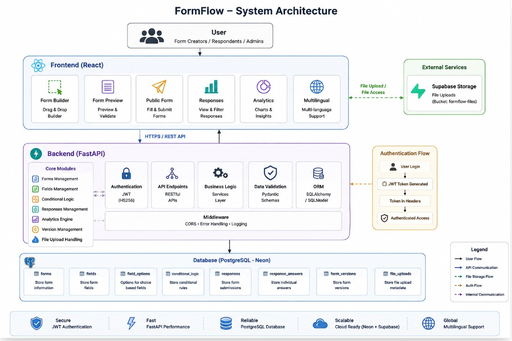

# FormFlow

**Low-Code Dynamic Form Workflow & Data Collection Platform**

FormFlow is a full-stack low-code platform for building dynamic forms, configuring fields/validations, defining conditional logic, publishing forms, collecting responses, managing versions, and analyzing data through an interactive dashboard — no code required.

---

## Features

**Form Builder** — Visual, drag-and-drop builder with add/edit/delete/duplicate/reorder fields, per-field configuration, auto-save, and live preview.

**Field Types** — Short Text, Long Text, Number, Email, Phone, URL, Date, Time, Radio, Checkbox, Dropdown, File Upload.

**Field Configuration & Validation** — Label, description, placeholder, required/optional, options (for choice fields), min/max value & length, and file-upload rules — enforced on submission.

**Conditional Logic** — Show/hide fields based on prior answers.
```
If "Are you a student?" = "Yes"  →  Show "College Name"
```

**Publishing** — `Draft → Published → Unpublished`. Published forms are accessible via the public form interface.

**Response Collection**
```
Public Form → Validation → FastAPI → Response Processing → PostgreSQL
```
Stores submissions, field-level answers, timestamps, and file-upload info.

**Response Dashboard** — View submissions, inspect individual responses, filter by field value (e.g. `Department = CSE`), and jump between raw data and analytics.

**Analytics** — Dynamically generated from a form's actual fields (not generic charts): totals, submission trends, field-level analytics, response distributions, and choice/checkbox breakdowns, rendered with Recharts.

**Versioning** — Tracks form-structure changes via stored version snapshots without losing prior configurations.

**File Uploads** — Handled via Supabase Storage (bucket: `formflow-files`), with metadata kept in the app database.

**Multilingual Support** — Built into the frontend.

---

## Authentication
JWT (HS256) with configurable access-token expiration, securing authenticated frontend↔backend sessions.

---

## Tech Stack

| Layer | Technologies |
|---|---|
| Frontend | React, Vite, React Router, Tailwind CSS, Recharts |
| Backend | Python, FastAPI, Pydantic, SQLAlchemy/SQLModel, Alembic |
| Database | PostgreSQL (Neon-hosted) |
| Storage | Supabase Storage |
| Auth | JWT |

---

## System Architecture

<p align="center">
  
</p>
```


## Database Schema

```
forms
├── fields
│   └── field_options
├── conditional_logic
├── responses
│   └── response_answers
├── form_versions
└── file_uploads
```
JSONB is used where flexible/dynamic configuration is needed.

| Table | Purpose |
|---|---|
| forms | Form info & config |
| fields | Fields per form |
| field_options | Options for radio/checkbox/dropdown |
| conditional_logic | Field visibility rules |
| responses | Submissions |
| response_answers | Per-field answers |
| form_versions | Version snapshots |
| file_uploads | Upload metadata |

---

## REST API

FastAPI-powered endpoints, grouped by resource:

- **Forms** — create, read, update, delete, publish, unpublish
- **Fields** — create, read, update, delete, configure
- **Field Types** — list supported types
- **Conditional Logic** — manage conditions & visibility rules
- **Responses** — submit, retrieve, filter
- **Analytics** — trends, field-level stats, distributions
- **Versions** — manage/retrieve form versions
- **File Uploads** — handle uploads & metadata

Docs: `http://localhost:8000/docs` (Swagger) · `http://localhost:8000/redoc` (ReDoc)

---

## Project Structure

```
FormFlow/
├── backend/
│   ├── app/{api, models, schemas, services, crud, database, main.py}
│   ├── alembic/versions/
│   ├── requirements.txt
│   └── .env
├── frontend/
│   ├── src/{components, pages, services, hooks, utils}
│   ├── public/
│   ├── package.json
│   └── vite.config.js
└── README.md
```

---

## Setup

**1. Clone**
```bash
git clone https://github.com/navyaalikanti/FormFlow && cd FormFlow
```

**2. Backend**
```bash
cd backend
python -m venv venv
source venv/bin/activate      # Windows: venv\Scripts\activate
pip install -r requirements.txt
# configure .env, then:
alembic upgrade head
uvicorn app.main:app --reload   # http://localhost:8000
```

**3. Frontend**
```bash
cd frontend
npm install
npm run dev                     # http://localhost:5173
```

**.env (backend)**
```env
DATABASE_URL=your_neon_postgresql_connection_string

JWT_SECRET_KEY=your_jwt_secret
JWT_ALGORITHM=HS256
ACCESS_TOKEN_EXPIRE_MINUTES=1440

CORS_ORIGINS=http://localhost:5173,http://localhost:5174,http://localhost:3000,http://localhost:8080

SUPABASE_URL=your_supabase_project_url
SUPABASE_SECRET_KEY=your_supabase_secret_key
SUPABASE_BUCKET=formflow-files
```

## Workflow

```
Create → Configure → Validate → Add Conditional Logic → Publish
   → Collect Responses → Filter → Analyze
```

1. **Create** — Dashboard → Create Form → Add Fields
2. **Configure** — Field config → Validation → Conditional Logic → Auto-save
3. **Publish** — Draft → Published → Public Form
4. **Collect** — Respondent fills → validated → submitted → stored in PostgreSQL
5. **Analyze** — Filter responses → run analytics → view field-level charts

---
